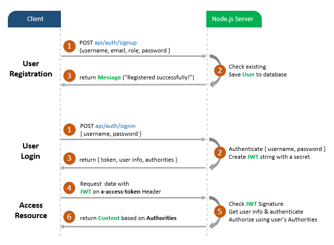
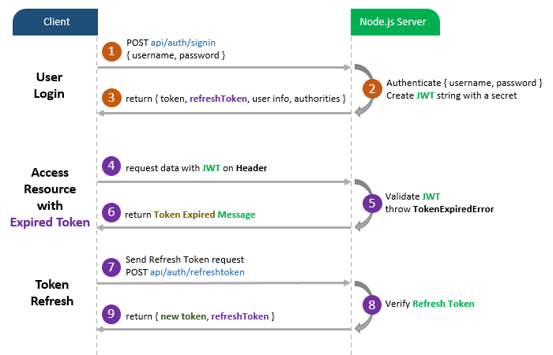

# Node.js JWT Refresh Token with MongoDB example
JWT Refresh Token Implementation with Node.js Express and MongoDB. You can know how to expire the JWT, then renew the Access Token with Refresh Token.

The code in this post bases on previous article that you need to read first:
> [Node.js + MongoDB: User Authentication & Authorization with JWT](https://github.com/JS-IT/node-js-mongodb-auth-jwt/)

## User Registration, User Login and Authorization process.

The diagram shows flow of how we implement User Registration, User Login and Authorization process.



And this is for Refresh Token:



## More Practice:
> [Node.js, Express & MongoDb: Build a CRUD Rest Api example](https://github.com/JS-IT/node-express-mongodb/)

## Project setup
```
npm install
```

### Run
```
node server.js
```
